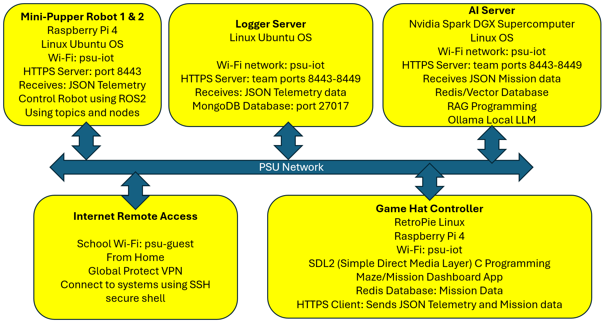

# abcapsp26TuThT4

# 🐾 Mini-Pupper Swarm Exploration with Secure AI-RAG Diagnostics

**Senior Capstone – Spring 2026 Tuesday and Thursday Team 4**  
**Penn State Abington – CMPSC & IT**

---

## 📌 Project Overview

This project implements a **secure, autonomous swarm of Mini-Pupper quadruped robots** capable of **parallel maze exploration** using **reinforcement learning**, **ROS2**, and **AI-assisted reasoning via RAG (Retrieval-Augmented Generation)**.

Robots operate locally with real-time autonomy while securely logging mission telemetry to a centralized system. A high-performance AI station performs **operator reasoning, diagnostics, and shared swarm intelligence** using vector databases.

---

## 🧩 System Architecture Overview



**Figure:** Secure Mini-Pupper swarm architecture showing robot control, telemetry flow, logging infrastructure, AI RAG server, and secure remote access.

## 🎯 Objectives

- Autonomous **multi-robot exploration** of an augmented-reality maze  
- Secure **robot-to-cloud telemetry and logging**
- **AI-assisted diagnostics** and mission reasoning using RAG
- Full **operational security** using certificates and mTLS
- Production-quality **testing, documentation, and DevOps workflow**
- Real-time **GUI mission dashboard** and teleoperation

---

## 🐕 Mini-Pupper Robot Platform

**Hardware**
- Raspberry Pi 4 Model B
- Quad-core ARM Cortex-A72 @ 1.5 GHz
- Camera + LiDAR
- 12 × Micro Servo Motors
- Dual power rails:
  - 5V → Raspberry Pi
  - 6V → Servos
- Wi-Fi (2.4 / 5 GHz)

**Software**
- Ubuntu Linux
- ROS2 (Foxy / Humble)
- Python
- AprilTags for identification & telemetry
- SSH for secure remote access
- X.509 digital certificates for identity

**Capabilities**
- Local autonomy
- Sensor fusion
- Secure communications
- Swarm participation

---

## 🧠 AI & Compute Infrastructure

### Quantum X Computer I9 (Telemetry & Logging)
- NVIDIA RTX 4090 GPU
- Mission + telemetry logging service
- MongoDB backend
- VPN-secured SSH access
- mTLS (mutual authentication)
- Certificate-based identity

### AI Station Spark (RAG & Reasoning)
- Spark DGX Supercomputer
- GB10 Grace Blackwell Superchip
- ~1 Petaflop performance
- 128 GB Unified LPDDR5X memory
- Secure VPN connectivity

**AI Services**
- RAG-based operator reasoning
- Diagnostics and anomaly detection
- Redis vector database for shared swarm knowledge

---

## 🎮 Teleoperation & GUI Dashboard

**Features**
- Raspberry Pi Game HAT controller
- Heads-Up Mission Dashboard
- Real-time robot health monitoring
- Mission activity visualization
- Log inspection and replay

**Tech Stack**
- Python Plotly Dash **or** React + ECharts
- FastAPI WebSockets for real-time updates
- Secure backend APIs
- MongoDB log integration

---

## 🔐 Security Architecture

- SSH for remote administration
- VPN for network isolation
- mTLS (mutual TLS):
  - Server proves identity
  - Robot/client proves identity
  - **mTLS is HTTPS client-to-server only** — it does not involve Redis, MongoDB, or other backend databases
- X.509 certificates for every robot
- Zero-trust communication model

---

## 🧪 Testing & Quality Assurance

The project follows **industry-grade testing standards** and ships **11
test suites** covering every major component:

| # | Suite | Source under test |
|---|---|---|
| 1 | `test_maze_agent.py` | `maze_agent.py` (multi-agent A* planner) |
| 2 | `test_maze_server.py` | `maze_server.py` (FastAPI + mTLS server) |
| 3 | `test_maze_redis.py` | `maze_redis.py` (session storage) |
| 4 | `test_rag_maze.py` | `rag_maze.py` (RAG pipeline, LLM summaries) |
| 5 | `test_maze_sdl2.py` | `maze_sdl2_final_send.c` (game client) |
| 6 | `test_maze_https_mongo.py` | `maze_https_mongo.c` (MongoDB log receiver) |
| 7 | `test_maze_https_redis.py` | `maze_https_redis.c` (mission queue receiver) |
| 8 | `test_maze_https_telemetry.py` | `maze_https_telemetry.c` (telemetry receiver) |
| 9 | `test_dashboard.py` | `dashboard/` (HTML + ES-module UI) |
| 10 | `test_tools_maze.py` | `tools_maze.py` (A* / legal-moves / plan validation) |
| 11 | `test_mtls_regression.py` | **mTLS / security** — cert files, policy, handshake |

All four testing levels are exercised:

- **Unit Testing** — pure-function checks (e.g., `tools_maze.astar`, cert
  modulus match)
- **Integration Testing** — cross-module paths (FastAPI routes + Redis,
  RAG pipeline + vector store, dashboard fetch → render)
- **System Testing** — end-to-end flows (SDL2 client → HTTPS → Redis,
  maze-solve → plan JSON)
- **Regression Testing** — `test_mtls_regression.py` is a dedicated
  Regression-level suite that locks in security invariants (ssl.CERT_REQUIRED
  branch, MHD_USE_TLS flag, DEFAULT_PORT 8446, handshake behavior) so
  refactors cannot silently weaken the security boundary

**Run everything**

```bash
python test_runners/run_all_tests.py           # all 11 suites
python test_runners/run_all_tests.py --suite mtls   # single suite
```

**Tooling**
- Custom `TestSuite` framework (`test_runners/test_framework.py`)
- `fakeredis` for in-memory Redis, `unittest.mock` for isolation
- `openssl` + Python `ssl` stdlib for real TLS handshakes in the
  mTLS regression suite (no external services required)
- GitHub Actions CI (`.github/workflows/ci-tests.yml`)

---

## 📦 Project Management & DevOps

- All code hosted on **GitHub**
- Python dependency management via **Poetry**
- Full **PyDoc documentation**
- SCRUM methodology
  - Stand-ups twice per week
- Issue tracking and milestones
- Versioned releases

---

## 📚 Key Technologies

- Robotics: Quadrupeds, ROS2
- AI/ML: Reinforcement Learning, RAG
- Databases: MongoDB, Redis (Vector DB)
- Security: VPN, SSH, mTLS, Certificates
- Web: FastAPI, WebSockets
- Visualization: Plotly Dash / React + ECharts

---

## 🚀 Expected Outcomes

- Demonstration of **parallel swarm exploration**
- Secure, real-world robotics deployment
- AI-assisted diagnostics using modern RAG pipelines
- Fully documented, production-ready system
- Scalable foundation for future research

---

## 👨‍🏫 Academic Context

This project serves as a **Senior Capstone** for students in:

- Computer Science (CMPSC)
- Information Technology (IT)

Emphasis is placed on:
- Systems engineering
- Secure distributed computing
- Robotics + AI integration
- Professional software practices

---

## 📜 License

This project is developed for academic and research purposes.  
Licensing will be determined prior to public release.

---

## ✨ Acknowledgments

- Penn State Abington
- CMPSC & IT Programs
- Open-source robotics and AI communities

---
