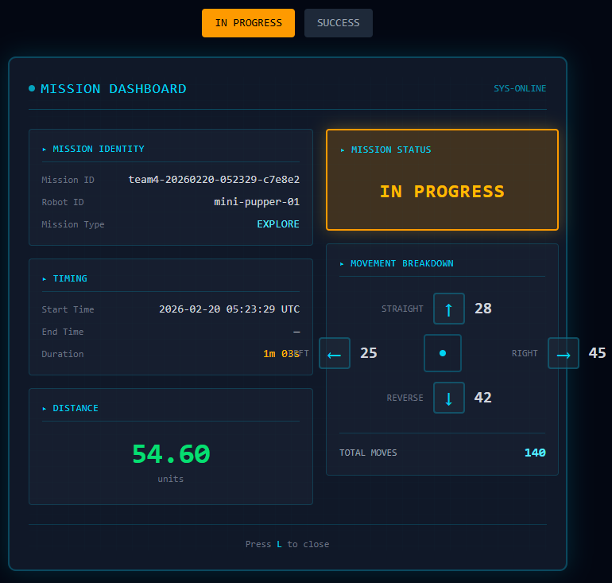
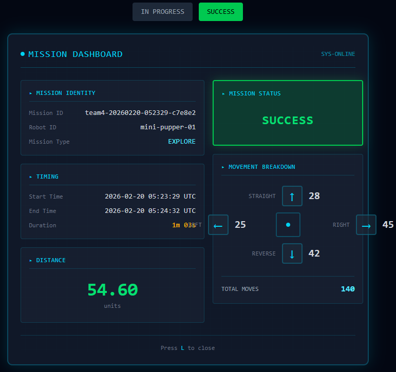
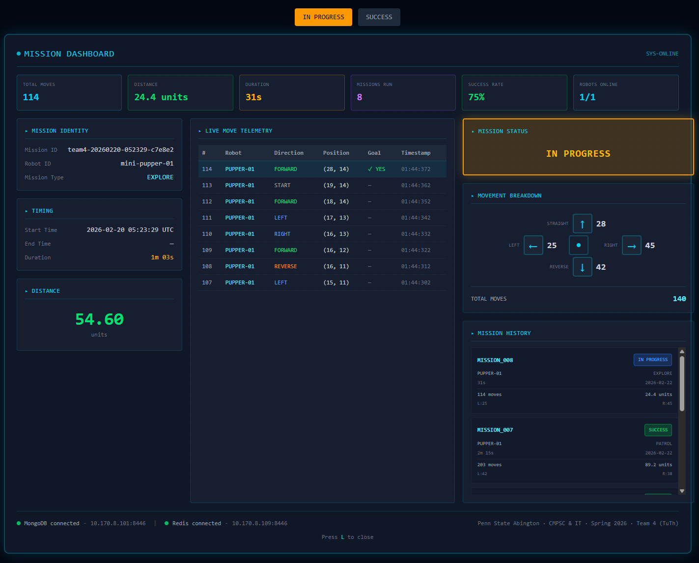
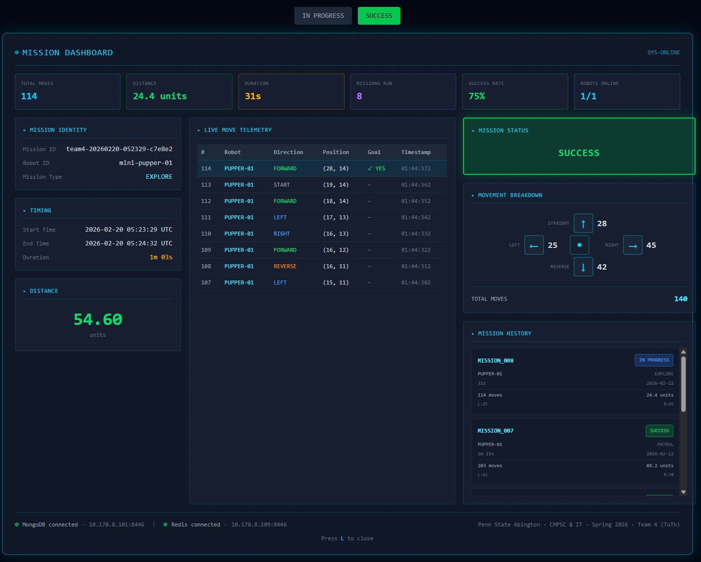

# Mission Dashboard Mockups

UI mockups for the in-game mission dashboard triggered by pressing **L** (Left Trigger) during gameplay.

---

## GameHat Controller — Local Redis Only

These mockups show the dashboard running on the **Raspberry Pi Game HAT** using only **local Redis** (`127.0.0.1:6379`) as the data source. No network connection to MongoDB is required.

**Data source:** `mission:{session_id}:summary` Redis hash

| Mockup | State | Description |
|--------|-------|-------------|
|  | **In Progress** | Mission is active. End Time shows "—", result is IN PROGRESS. |
|  | **Success** | Mission complete. End Time is filled in, result is SUCCESS. |

**Panels displayed:**
- Mission Identity (ID, Robot, Type)
- Mission Status badge
- Timing (Start, End, Duration)
- Movement Breakdown (D-pad with directional counts)
- Distance

---

## Full Dashboard — Local Redis + MongoDB

These mockups show the expanded dashboard that also pulls **live move telemetry from MongoDB** (`10.170.8.101:8446`) in addition to local Redis. Includes per-move position tracking, summary stats, and mission history.

**Data sources:**
- `mission:{session_id}:summary` Redis hash (mission stats)
- `maze.team4ttmoves` MongoDB collection (per-move telemetry with X, Y positions)

| Mockup | State | Description |
|--------|-------|-------------|
|  | **In Progress** | Full dashboard with live telemetry table, stats bar, and mission history. |
|  | **Success** | Full dashboard showing completed mission with End Time filled in. |

**Additional panels (over the GameHat version):**
- Summary stat cards (Total Moves, Distance, Duration, Missions Run, Success Rate, Robots Online)
- Live Move Telemetry table (move #, robot, direction, X/Y position, goal status, timestamp)
- Mission History sidebar (past missions with status badges)
- Connection status footer (MongoDB + Redis)
